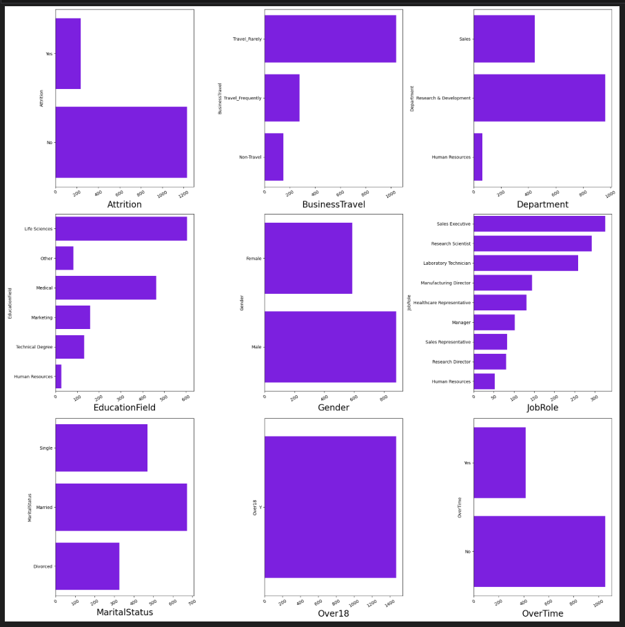
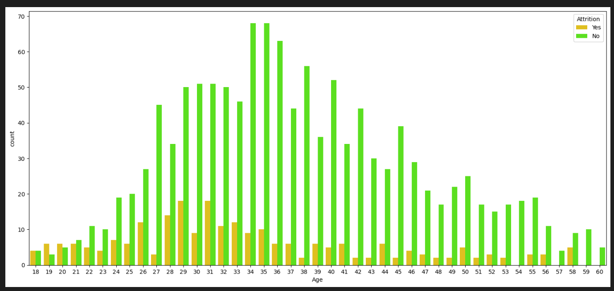
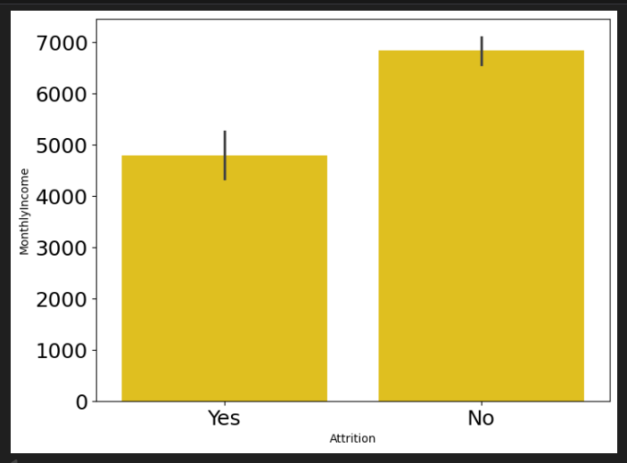
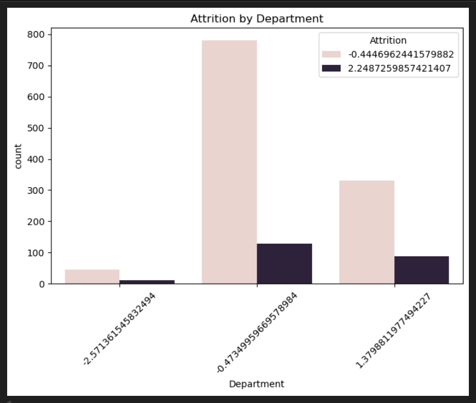
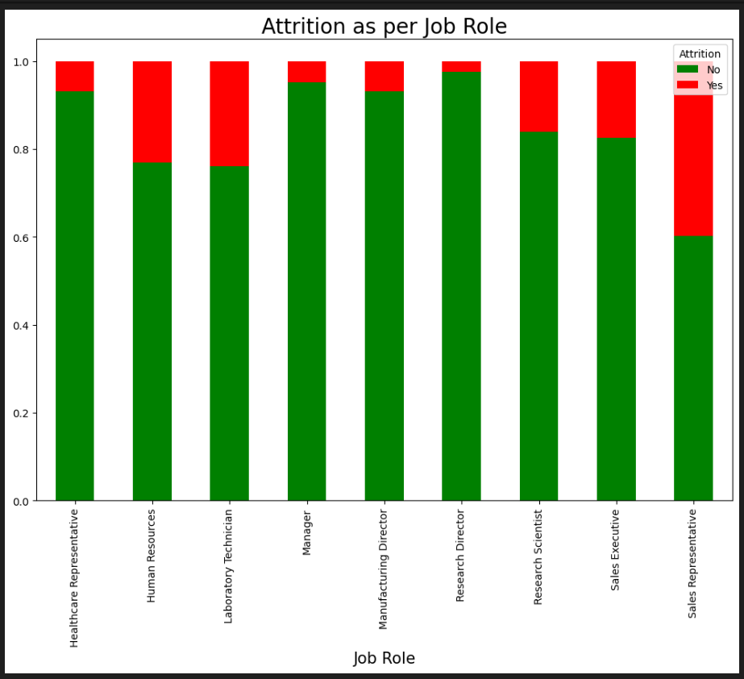
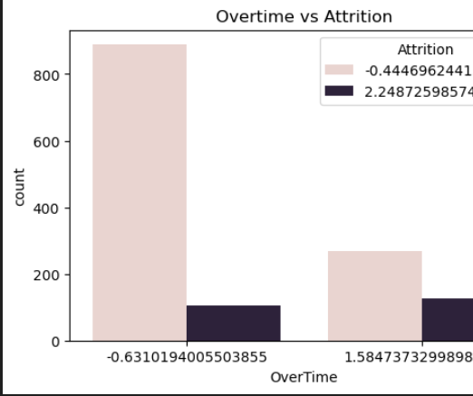

# Employee Attrition Analysis | HR Analytics Project

## 📌 Problem Statement
Employee attrition is a major challenge for organizations, leading to increased hiring costs, loss of experienced talent, and reduced productivity. This project analyzes HR data to identify the key factors contributing to employee attrition.

---

## 🎯 Objective
- Analyze patterns behind employee attrition
- Identify important factors influencing employee turnover
- Provide data-driven insights to improve employee retention

---

## 📂 Dataset
HR Employee Attrition dataset containing:
- Employee demographics
- Job roles and departments
- Salary and compensation details
- Work conditions such as overtime, job satisfaction, and tenure

---

## 🛠️ Tools & Technologies Used
- Python
- Pandas
- NumPy
- Matplotlib
- Seaborn
- Jupyter Notebook

---

## 🧹 Data Preprocessing
- Checked missing values and duplicates
- Handled categorical variables
- Verified and corrected data types
- Performed data quality checks

---

## 📊 Exploratory Data Analysis (EDA)
The following analyses were performed:
- Attrition distribution
- Attrition vs Age
- Attrition vs Monthly Income
- Attrition vs Department
- Attrition vs Job Role
- Attrition vs Overtime
- Attrition vs Years at Company
- Correlation Heatmap

---

## 🔍 Key Insights
- Employees working overtime show significantly higher attrition
- Lower monthly income is strongly associated with higher attrition
- Sales department has the highest attrition rate
- Job role and job satisfaction greatly impact retention
- Younger employees tend to leave more frequently

---

## 📈 Important Visualizations

---

## ✅ Conclusion
Overtime, income level, job role, department, and job satisfaction are the major drivers of employee attrition. These insights can help HR teams design effective retention strategies and improve employee engagement.
